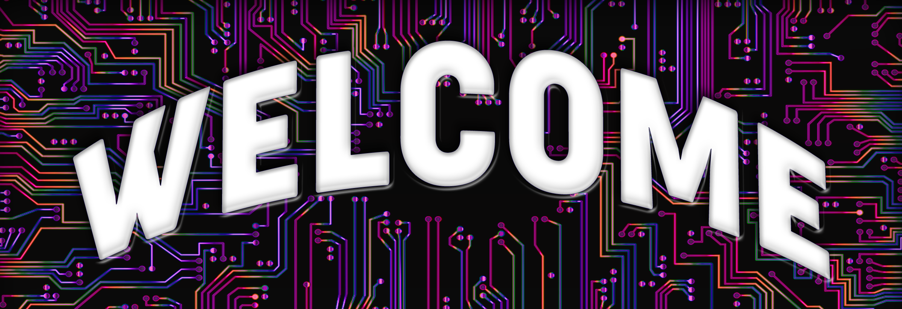

<h1 align="center"> I'm Leigh. Nice to meet you! </h1>

<!--------------------- Links ---------------------->
<h2 align="center"> Full Stack Software Engineer</h2>
 

<h3 align="center"> Contact: </h3>

    <!--  -->
    
    

 

 I am currently looking for a Full-Stack or Front-End role that will allow me to flourish. I am learning more every day and look forward to the next challenge. Stay awhile, check out my page!

 

<!--------------------- Technologies That I Have Used ---------------------->
<h2 align="center">🤖 Technologies 🤖</h2>

<!--------------------- Frontend ---------------------->
<h4 align="center">Frontend</h4>

    
    
    
    
    
    

<!--------------------- Backend ---------------------->
<h4 align="center">Backend</h4>

    
    
    
    
    

<!--------------------- Tools ---------------------->
<h4 align="center">Tools</h4>

    
    
    
    
    
    

 
 

  

